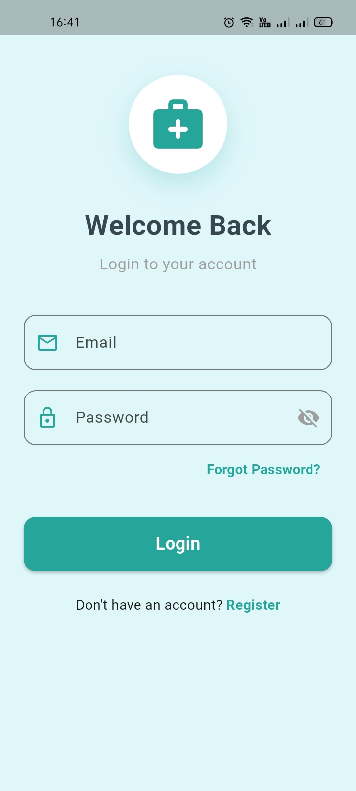
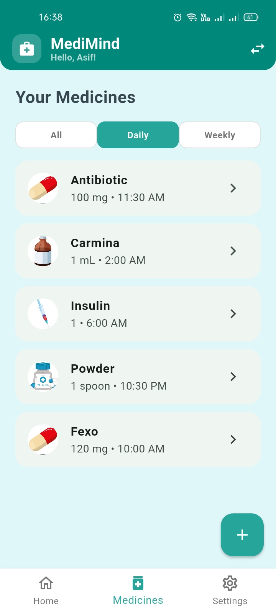
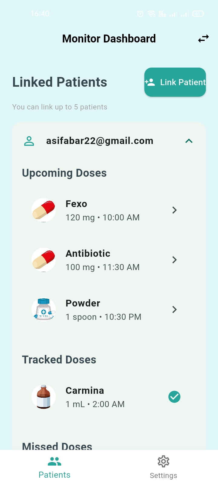

# MediMind 💊


## 📌 Project Overview

**MediMind** is a mobile application designed to improve medication adherence and health management for patients and caregivers.

The application is designed especially for elderly and chronically ill individuals who may need regular medication reminders and support from family members or caregivers.

MediMind provides a simple platform where patients can manage their medications and caregivers can monitor medication schedules and adherence.

> **Note:** MediMind is an academic mobile application developed as a 3rd-year project for the Department of Computer Science and Engineering at Leading University.

## 🎯 Project Objectives

The main objectives of MediMind are:

* Help patients remember their medication schedules.
* Allow patients to manage their medications and dosages.
* Provide medication reminders at specific times.
* Allow caregivers to monitor a patient's medication adherence.
* Provide offline medication alerts.
* Synchronize medication information using Firebase.
* Provide separate interfaces for Patients and Monitors.

## 👥 User Roles

MediMind provides two main user roles:

### 1. Patient
Patients can:
* Create and manage their account.
* Add medications.
* Set medication dosage information.
* Schedule daily or weekly medication reminders.
* Receive medication alerts.
* Track whether medications were taken or missed.
* Allow caregivers to monitor their medication status.

### 2. Monitor / Caregiver
Monitors can:
* Connect to a patient's account.
* View the patient's medication schedule.
* Monitor medication adherence.
* Check whether scheduled doses were taken or missed.
* Help family members stay informed about the patient's medication status.

## 🚀 Main Features

| Feature | Description |
| :--- | :--- |
| **Dual-Mode Interface** | Separate dashboards for Patients and Monitors |
| **Medication Management** | Add medications, dosage information, and schedules |
| **Daily / Weekly Scheduling** | Configure medication schedules based on specific days and times |
| **Offline Alerts** | Receive medication reminders without requiring an active internet connection |
| **Caregiver Monitoring** | Allow caregivers to monitor medication adherence |
| **Multiple Caregivers** | Up to five family members or caregivers can be linked to a patient |
| **Firebase Authentication** | Secure email/password-based user authentication |
| **Cloud Synchronization** | Synchronize application data through Firebase |

## 🧠 System Architecture

MediMind follows an object-oriented application structure using Flutter and Firebase. The major components of the system are:

* **Flutter UI:** Provides the mobile application interface.
* **Patient Module:** Handles patient medication management and tracking.
* **Monitor Module:** Handles caregiver monitoring features.
* **Authentication Module:** Manages user registration and login.
* **Medication Module:** Stores medication information and schedules.
* **Notification Module:** Handles medication reminder alerts.
* **Firebase Backend:** Provides authentication and cloud data synchronization.

## 🔔 Medication Reminder System

The medication reminder system allows patients to configure:
* Medication name
* Dosage
* Specific reminder time
* Daily schedules
* Weekly schedules

The application can generate local medication alerts on the device so that users can receive reminders even when an active internet connection is not available.

## ☁️ Firebase Integration

Firebase is used as the backend service for MediMind. The project uses Firebase for:
* User authentication
* User account management
* Medication data storage
* Real-time data synchronization
* Cloud-based application data

Depending on the project configuration, Firebase Realtime Database and/or Cloud Firestore can be used for storing application data.

## 📱 Mobile UI Screenshots

<div align="center">
  
  
  
</div>

## 🛠️ Technology Stack

| Technology | Purpose |
| :--- | :--- |
| **Flutter** | Mobile application development |
| **Dart** | Programming language |
| **Firebase Authentication** | User authentication |
| **Firebase RTDB / Firestore** | Cloud data storage and synchronization |
| **Android** | Target platform |
| **Android Studio / VS Code** | Development environment |

## ⚙️ Installation & Usage

**1. Clone the Repository**

```bash
git clone https://github.com/sr-hridoy/medimind_app.git
cd medimind_app
```

#### 2. Install Dependencies

Install the Flutter dependencies using:

```bash
flutter pub get
```

#### 3. Configure Firebase

Create or open the MediMind project in Firebase Console.

Download the Firebase Android configuration file:

```text
google-services.json
```

Place the file inside:

```text
android/app/google-services.json
```

> **Security:** Do not commit private credentials or sensitive configuration files to a public repository.

#### 4. Run the Application

Connect an Android device or start an Android emulator.

Then run:

```bash
flutter run
```

---

## 📂 Project Structure

A simplified project structure is shown below:

```text
medimind_app/
│
├── android/
│
├── assets/
│   └── screenshots/
│       ├── login.png
│       ├── patient_dashboard.png
│       └── monitor_dashboard.png
│
├── lib/
│   ├── ...
│
├── Project_Report.pdf
├── pubspec.yaml
├── README.md
└── LICENSE
```

---

## 📚 Documentation

The complete project report provides detailed information about the system, including:

* System Architecture
* Use Case Diagrams
* Data Flow Diagrams (DFD)
* Entity Relationship Diagrams (ERD)
* System Design
* Implementation Details
* Testing and Results

### 📄 Project Report

[**View Full Project Report →**](./Project_Report.pdf)

> Make sure `Project_Report.pdf` is uploaded to the root directory of the repository.

---

## 📱 App Download

A compiled Android APK can be made available through GitHub Releases.

[**📥Download APK →**](../../releases)

---

## 🎓 Academic Project

MediMind was developed as a 3rd-year academic project for the Department of Computer Science and Engineering at Leading University.

| Information | Details |
|---|---|
| **Department** | Computer Science and Engineering |
| **University** | Leading University |
| **Project Type** | Academic Mobile Application |
| **Target Platform** | Android |

---

## 👥 Contributors

### Development Team

* **Ispak Jahan Ispa**
* **M. M. Asif Bin A. Rahman**
* **Md. Shaifur Rahman Hridoy**

## 👨‍🏫 Project Supervisor

| Information | Details |
|---|---|
| **Name** | Md. Jamaner Rahaman |
| **Designation** | Assistant Professor |
| **Department** | Computer Science and Engineering |
| **University** | Leading University |

---

## 🔒 Security

MediMind uses Firebase for authentication and cloud-based data management.

For security and privacy:

* Do not commit private credentials.
* Do not expose sensitive configuration files.
* Use appropriate Firebase security rules.
* Restrict database access according to user roles.

---

## 📄 License

This project is licensed under the MIT License.

See the [LICENSE](./LICENSE) file for details.

---

## ❤️ About MediMind

MediMind was developed with the goal of making medication management easier for patients while helping caregivers stay informed about medication schedules and adherence.

The application brings together:

**Medication Management • Scheduling • Reminders • Patient Tracking • Caregiver Monitoring • Cloud Synchronization**

into a single mobile platform designed to support patients and their families.

```

This keeps the **app-repository style** professional: badges, a concise project introduction, feature presentation, user-mode table, tech stack, architecture, UI showcase, setup, documentation, download, team, security, and license—without turning the README into a copy of your CG project's structure.
```
